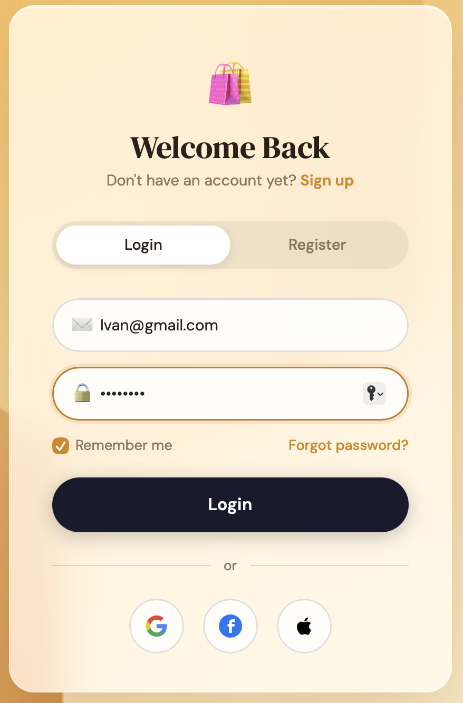
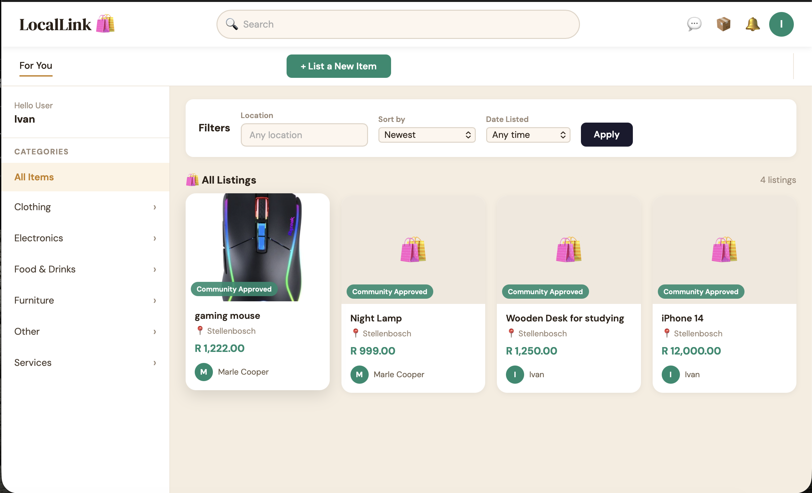
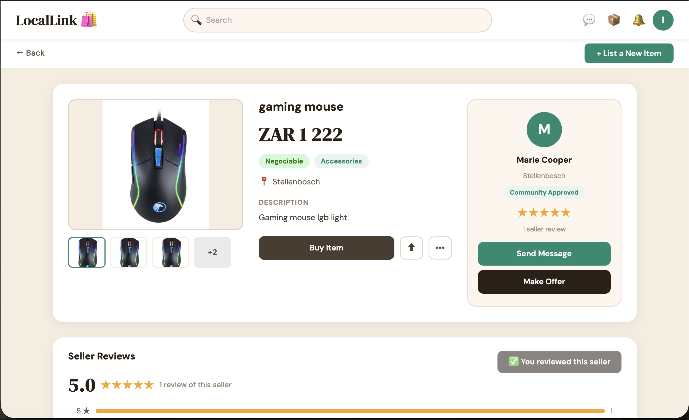
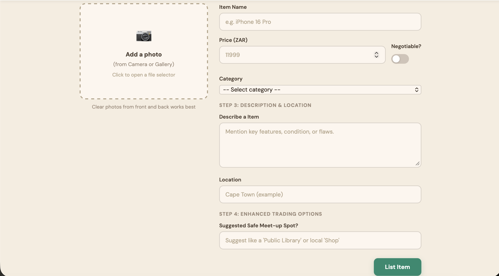
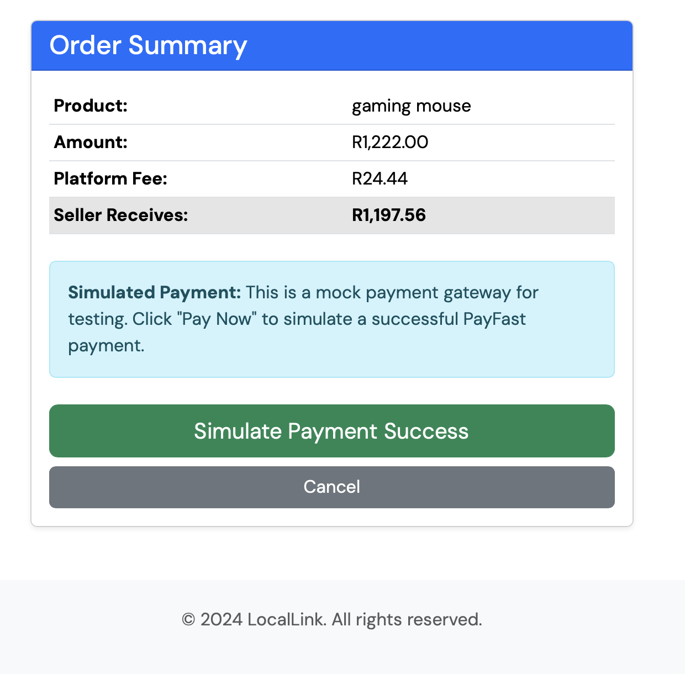
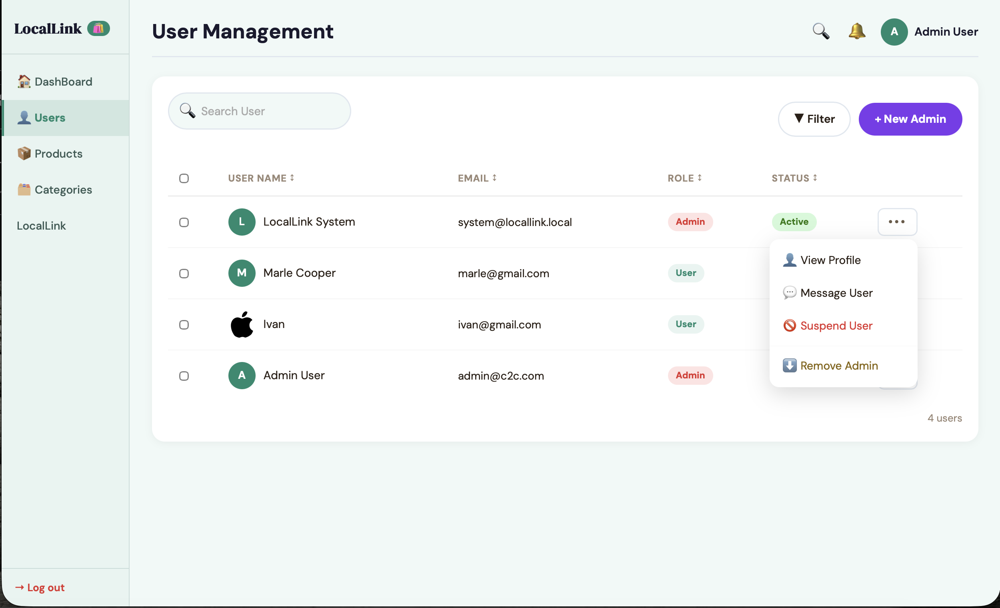
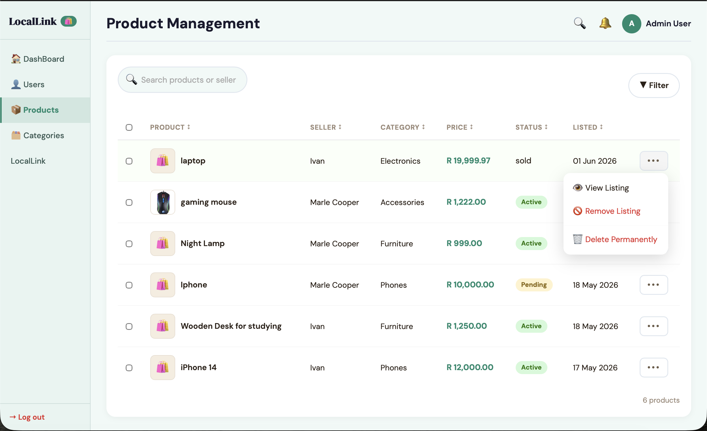
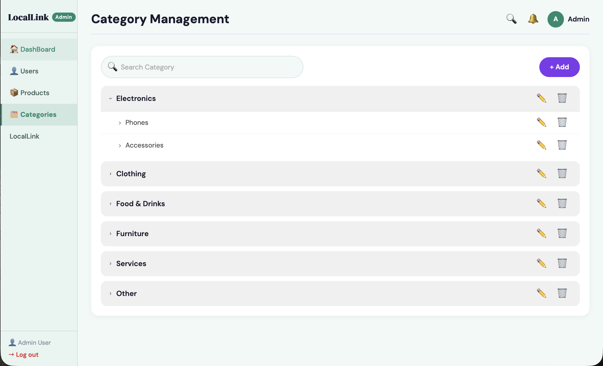

# LocalLink 🛒🤝

> A responsive peer-to-peer e-commerce platform designed to empower informal traders, local sellers, and community buyers through accessible digital commerce.

[](https://www.php.net/)
[](https://www.mysql.com/)
[](https://developer.mozilla.org/en-US/docs/Web/JavaScript)
[](https://getbootstrap.com/)

---

## 📌 Problem & Overview

Informal traders and micro-entrepreneurs often lack access to traditional e-commerce infrastructure due to complex setup requirements, high transaction fees, or poor desktop-centric interfaces. 

**LocalLink** addresses this gap by providing a lightweight, mobile-first web marketplace tailored for hyper-local trading. It connects local sellers directly with nearby buyers through a simplified product discovery pipeline, real-time communication features, and role-based administrative oversight.

---

## ✨ Key Features

- **Role-Based Access Control (RBAC):** Dedicated views and permissions for **Buyers**, **Sellers**, and **Platform Administrators**.
- **Interactive Marketplace:** Dynamic product listings with real-time category filtering, search, and pagination powered by AJAX.
- **Seller Dashboard:** Streamlined product management interface allowing vendors to create, edit, update stock, and track listing analytics.
- **Live Buyer-Seller Communication:** Asynchronous messaging mechanism enabling direct negotiation and inquiry routing.
- **Admin Dashboard:** Platform management interface for listing moderation, user account handling, and system overview.
- **Responsive & Lightweight:** Optimized frontend UI using Bootstrap and custom CSS for high performance across mobile devices and low-bandwidth connections.

---

## 📸 Application Walkthrough & User Flow

### 1. User Authentication & Marketplace Discovery
Secure account access paired with real-time location and category filtering for local item discovery.

| User Login Interface | Marketplace & Category Filtering |
| :---: | :---: |
|  |  |
| *Authentication UI supporting email & social logins* | *Live item listings with location & category filters* |

---

### 2. Product Detail, Negotiation & Checkout Process
Interactive item showcase featuring seller ratings, direct buyer-seller interaction, and simulated transaction verification.

| Item Details & Seller Profiles | Safe Meet-Up Item Creation Form | Simulated Payment Gateway |
| :---: | :---: | :---: |
|  |  |  |
| *Product page with ratings & offer options* | *Listing builder with safe meet-up suggestions* | *Order breakdown with fee calculation* |

---

### 3. Administrative Control & Platform Moderation
Dedicated administration suite providing governance over registered users, listed inventory, and product categories.

| User Account Management | Product Inventory Governance | Category Structure Setup |
| :---: | :---: | :---: |
|  |  |  |
| *User roles, status actions & profile controls* | *Product moderation, approval & removal actions* | *Dynamic taxonomy & category tree management* |
---
## 🛠️ Tech Stack & Architecture

- **Backend:** PHP (RESTful API endpoints, Session Authentication, Request Handlers)
- **Database:** MySQL (Relational Schema, Foreign Key Constraints, Indexed Querying)
- **Frontend:** HTML5, CSS3, JavaScript (ES6+ AJAX fetch workflows), Bootstrap 5
- **Tooling & Environment:** Apache / XAMPP / macOS environment, Git

---

## 🚀 Quick Start & Local Setup

### Prerequisites

- **PHP 7.4+** or **8.x**
- **MySQL Database Server**
- Local Web Server environment (**XAMPP**, **MAMP**, or native Apache/Nginx)

### Installation Steps

1. **Clone the Repository**
   ```bash
   git clone [https://github.com/Ivan-2002/LocalLink-Project.git](https://github.com/Ivan-2002/LocalLink-Project.git)
   cd LocalLink-Project

   2. **Database Configuration**
   - Start your local MySQL server.
   - Import the database schema file located in `/database` (or `locallink.sql`) into your MySQL management tool (e.g., phpMyAdmin or MySQL CLI):
     mysql -u root -p locallink_db < path/to/locallink.sql

3. **Configure Environment Variables / Connection Credentials**
file with your local credentials:
     define('DB_HOST', 'localhost');
     define('DB_USER', 'your_mysql_user');
     define('DB_PASS', 'your_mysql_password');
     define('DB_NAME', 'locallink_db');

4. **Launch the Application**
   - Place the project folder into your server root directory (e.g., `htdocs` for XAMPP or `www` for WAMP).
   - Navigate to `http://localhost/LocalLink-Project` in your browser.

---

## 📁 Repository Structure

LocalLink-Project/
├── api/             # AJAX backend handlers and data providers
├── assets/          # CSS stylesheets, JS scripts, images, and fonts
├── config/          # Database connections and global configurations
├── controllers/     # Core application logic and request routers
├── database/        # SQL schema dumps and initial migration files
├── views/           # UI components, dashboard layouts, and pages
└── index.php        # Application entry point

---

## 💡 Engineering Highlights & Takeaways

- **Database Normalization:** Designed relational schemas for users, product categories, messages, and orders with strict foreign key constraints to ensure transactional integrity.
- **Asynchronous UI Updates:** Implemented AJAX requests using native JavaScript `fetch()` calls to eliminate full page reloads during search and real-time interactions.
- **Security Considerations:** Structured SQL queries using PDO/prepared statements to prevent SQL Injection and integrated session-based authentication checks across protected routes.

---

## 👤 Author

**Ivan**
- Software Engineering Student
- GitHub: [@Ivan-2002](https://github.com/Ivan-2002)
